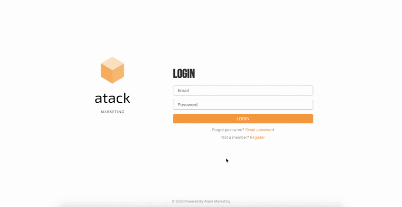
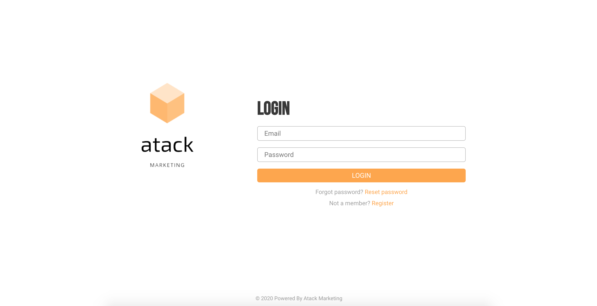
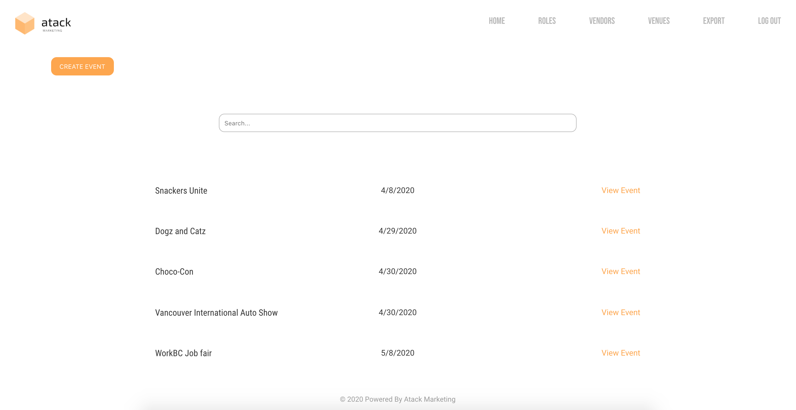
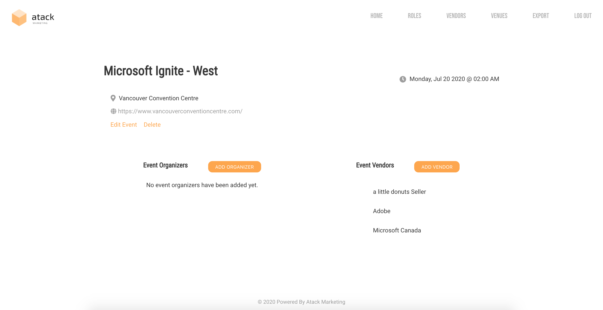
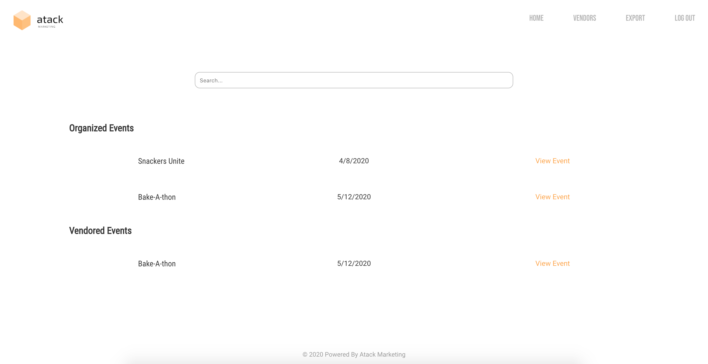
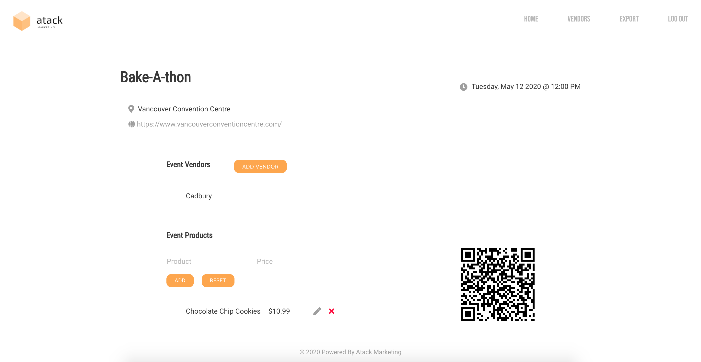
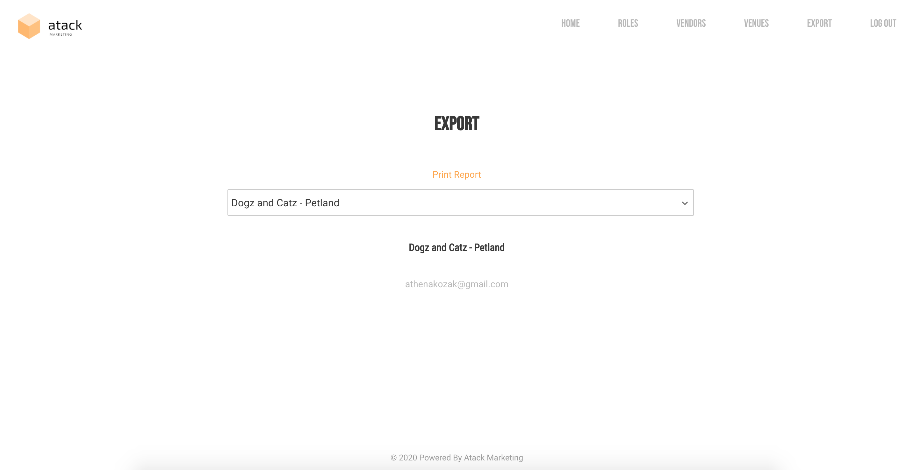

# Industry - SSD
A React and .NET Marketing Web Application created by Athena, Tony, Albert, Crystal, Kasra. Copyright 2020.

## Installation
`git clone`
`cd AtackMarketing`
`yarn install`

## Features
Admin:
- Full access privileges
- Add and manage events
- Add event organizers and vendors to events
- Manage user roles

Event Organizer:
- Add and manage vendors for events

Vendors:
- Add and manage marketing products
- View and export all subscribers for an event

Unique QR Generator:
- Created when a vendor is added to an event
- Updates automatically with changes in vendor's marketing products
  
## Technologies
- React
- .NET
- Adobe XD

## Application Prototype
[View the full prototype on Adobe XD](https://xd.adobe.com/view/8de0cde6-1fff-47b7-68f2-06945b2658b0-fbd1/)

## Web App - Admin

## Web App - Event Organizer / Vendor

## What's Next?
- Add view filters to screens
- Edit profile details
- Downloadable export list
- Multi-selector functionality
- Upload images to events and vendors
