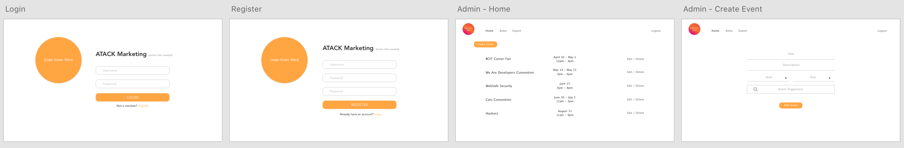
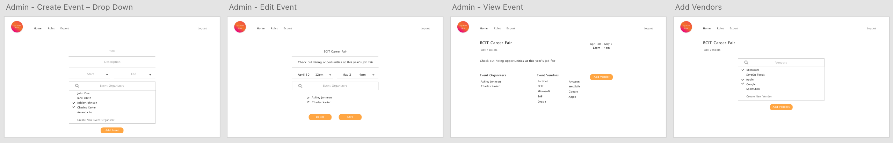
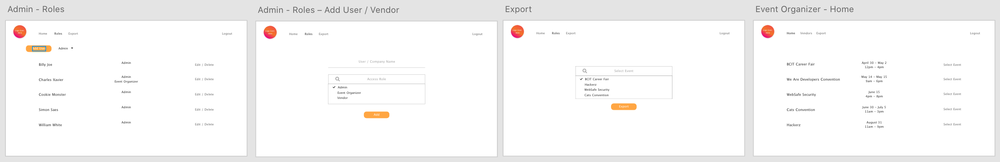
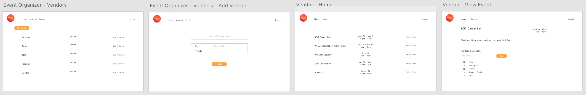
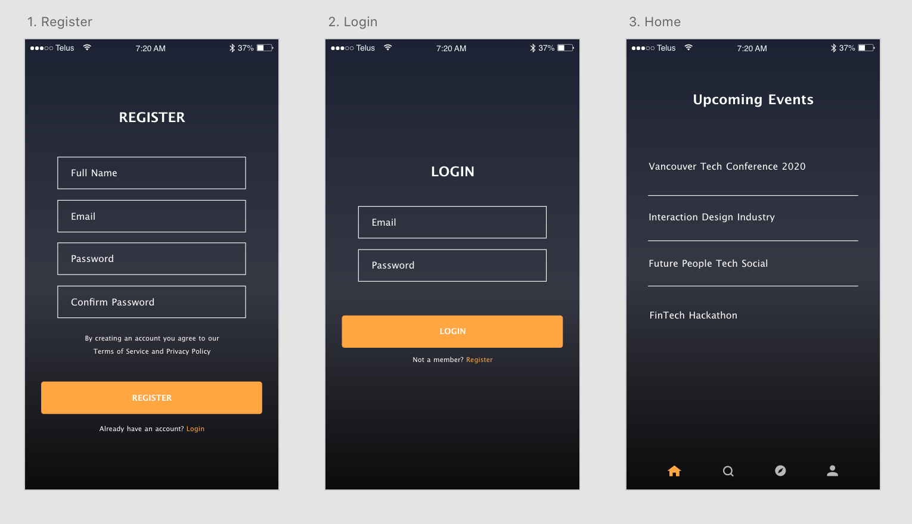
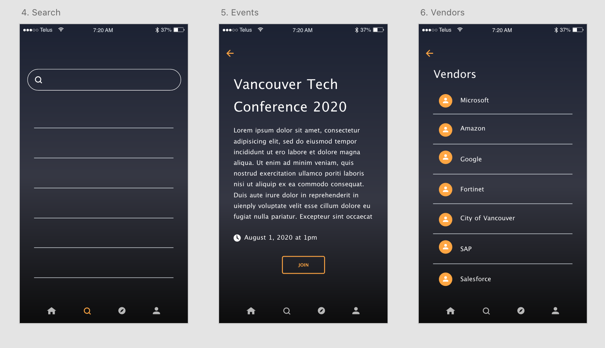
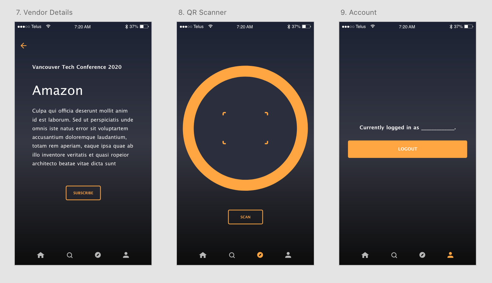

# Industry - SSD
A React Native and .NET Marketing Application created by Athena, Tony, Albert, Crystal, Kasra. Copyright 2020.

## Installation
`git clone`
`cd MarketingWeb`
`yarn install`

## Features Web: User Management
Admin: (Full Access)
- Add and manage events
- All permissions that event organizers have

Event Organizer:
- Add and manage vendors
- All permissions that vendors have

Vendors:
- Add and manage marketing materials
- View and export all subscribers (per event or app wide)

Unique QR Generator:
- Created when a vendor is added to an event
  - Pending further review
  
## Features Mobile: Guest Access
User Profile:
- Register
- Login

QR Scanner:
- Implements camera

Search / View Event:
- Users can join and leave events
- View vendors
- Information displayed in a list and detail view
- Sort functionality (nice-to-have)

## Technologies
- React Native
- .NET
- Adobe XD

## Application Prototypes

## Web App
[View the full prototype on Adobe XD](https://xd.adobe.com/view/8de0cde6-1fff-47b7-68f2-06945b2658b0-fbd1/)

## Mobile App
[View the full prototype on Adobe XD](https://xd.adobe.com/view/af850f75-0f9d-414c-6f33-cc7305f76382-d9b4/)

